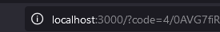
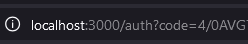

---

# PteroPal - Pterodactyl Server Manager & Backup Bot

PteroPal is a Discord bot that simplifies the management and backup of game servers hosted on Pterodactyl. With easy-to-use commands, users can control their servers directly from Discord and automatically back up server data to Google Drive.

## Features

- **Pterodactyl Server Management:**
  - Manage servers directly from Discord using commands like:
    - `.servers` – View the list of servers.
    - `.start <number>` – Start a specific server.
    - `.stop <number>` – Stop a specific server.
  - Fetch server statuses and control server power actions using the Pterodactyl API.

- **Daily Backup to Google Drive:**
  - Every day at 4:00 AM Sri Lanka time, all active servers are automatically shut down.
  - At 4:20 AM, a backup process uploads specific folders from the local machine to Google Drive.
  - OAuth2 authentication is used for Google Drive, with automatic directory creation for backups.

- **Resource Management:**
  - Servers are shut down during backups to free up VPS resources for other tasks.

## Prerequisites

- Pterodactyl server
- Google Cloud Console for Google Drive API credentials
- Discord bot token

## Installation

1. Create a folder named `pteropal` and add your JSON files there.
2. Create and edit the `docker-compose.yml` file to configure the environment:

    ```bash
    nano docker-compose.yml
    ```

    Example `docker-compose.yml`:

    ```yaml
    version: '3'
    services:
      pteropal:
        image: nubsuki/pteropal
        volumes:
          - /pteropal/token.json:/app/token.json  # Mount the token file
          - /pteropal/credentials.json:/app/credentials.json  # Mount Google Drive credentials
        environment:
          - DISCORD_TOKEN=# Discord bot token
          - PTERODACTYL_API_URL=# Pterodactyl API URL
          - PTERODACTYL_API_KEY=# Pterodactyl API key
          - FOLDER_NAMES=# Comma-separated folder names for backup
          - FOLDER_PATHS=# Comma-separated folder paths for backup
          - TZ=Asia/Colombo
        ports:
          - "3000:3000"
        restart: unless-stopped
    ```

3. Start the bot:

    ```bash
    docker-compose up -d
    ```

## Google Drive API Setup

1. Go to the [Google Cloud Console](https://console.cloud.google.com/) and sign in.

2. Create a new project:
   - Click on the project dropdown in the top-left corner.
   - Select "New Project" and give it a name (e.g., "Drive API Project").
   - Click "Create."

3. Enable the Google Drive API:
   - In the left sidebar, go to **APIs & Services > Library**.
   - Search for "Google Drive API" and click "Enable."

4. Create OAuth credentials:
   - Go to **APIs & Services > Credentials**.
   - Click **Create Credentials** and select **OAuth 2.0 Client ID**.
   - Choose **Web application**, add `http://localhost:3000` to the **Authorized redirect URIs**.
   - Select the scope for **Google Drive API** with `.../auth/drive.file`.
   - Download the credentials JSON, rename it to `credentials.json`, and place it in your bot folder.

5. Run the bot, which will prompt you with a link. Authorize your account via this link, and the bot will generate and save a `token.json` for future access.

## Common Error Fix (OAuth2 Callback Issue)

The authorization URL should look like this:

```
http://localhost:3000/auth?code=4/0AV...
```

But when opened in your browser, it may redirect to:

```
localhost:3000/?code=4/0...
```

If this happens, manually adjust the URL by adding `/auth` like this:

```
http://localhost:3000/auth?code=4/0...
```

### Example of URL Before Fix:



### Example After Fix:



## Daily Backup Schedule

- **4:00 AM** – All active servers are shut down to free resources.
- **4:20 AM** – Backup process starts, uploading specific folders to Google Drive.

The bot automatically checks the server status every 2 minutes and handles backup and shutdown at 4:00 AM Sri Lanka time.

## License

This project is provided for personal use and is distributed "as-is." Please make sure to back up your files before using.

---